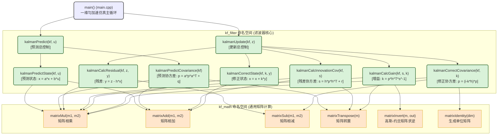

# 卡尔曼滤波 C++ 教学程序说明文档

本项目在根目录下完成了一个常规卡尔曼滤波（Kalman Filter）C++ 教学示例项目的开发。该项目严格遵循**过程化设计**，将底层矩阵计算与上层卡尔曼更新方程进行完全解耦，且**每个函数和与之对应的文件都有独立的头文件与源文件（完全使用小驼峰命名的对应关系）**，采用了符合专业规范的**接口与实现分离模式（Standard Library Layout）**。

---

## 目录结构

所有文件已在相应子目录中创建完毕：

```text
kalmanFilter/ (项目根目录)
 ├── CMakeLists.txt                 # CMake 构建配置文件
 ├── main.cpp                       # 仿真与滤波器验证主程序
 ├── Readme.md                      # 说明文档 (本文件)
 ├── include/                       # 所有的头文件 (.h)
 │    ├── math/                     # 通用矩阵数学库头文件
 │    │    ├── matrixDef.h          # 矩阵数据结构 Matrix 定义 (小驼峰文件名，下同)
 │    │    ├── matrix.h             # 矩阵库总聚合头文件
 │    │    ├── matrixCreate.h       # 创建矩阵
 │    │    ├── matrixIdentity.h     # 创建单位矩阵
 │    │    ├── matrixAdd.h          # 矩阵加法
 │    │    ├── matrixSub.h          # 矩阵减法
 │    │    ├── matrixMul.h          # 矩阵乘法
 │    │    ├── matrixTranspose.h    # 矩阵转置
 │    │    ├── matrixInvert.h       # 矩阵求逆 (高斯-约旦消元法)
 │    │    └── matrixPrint.h        # 矩阵输出打印
 │    └── filter/                   # 滤波器算法库头文件
 │         ├── kalmanDef.h          # 滤波器结构体 KalmanFilter 定义 (小驼峰文件名，下同)
 │         ├── kalman.h             # 滤波器总聚合头文件
 │         ├── kalmanInit.h         # 初始化滤波器
 │         ├── kalmanPredictState.h       # 状态外推预测
 │         ├── kalmanPredictCovariance.h  # 协方差外推预测
 │         ├── kalmanPredict.h            # 预测总控制
 │         ├── kalmanCalcResidual.h       # 计算残差
 │         ├── kalmanCalcInnovationCov.h # 计算残差协方差
 │         ├── kalmanCalcGain.h           # 计算卡尔曼增益
 │         ├── kalmanCorrectState.h       # 修正状态
 │         ├── kalmanCorrectCovariance.h  # 修正协方差
 │         └── kalmanUpdate.h              # 更新总控制
 ├── src/                           # 所有的源实现文件 (.cpp)
 │    ├── math/                     # 矩阵库函数实现 (例如 matrixCreate.cpp)
 │    └── filter/                   # 滤波器步骤函数实现 (例如 kalmanInit.cpp)
 └── analysis/                      # 数据分析与可视化文件夹 (已整理)
      ├── results.txt               # 运行 demo 重定向输出的数据日志
      ├── plot_results.py           # 用于读取结果并绘图的 Python 脚本
      ├── tuning_experiment.py      # 对比参数调优前后的仿真实验脚本
      ├── kalman_filter_results.png # 位置、速度和加速度估计的默认趋势图
      └── kalman_tuning_comparison.png # 默认滤波器与调优滤波器在速度、加速度上的跟踪对比图
```

---

## 函数层级关系与公式映射 (Function Hierarchy & Formulas)

本项目实现了底层的通用矩阵计算库（命名空间 `kf_math`）与上层卡尔曼滤波器核心算法（命名空间 `kf_filter`）的完全解耦。

### 1. 直观的函数层级调用与数学公式映射树

以下树状图直观地展示了主程序到卡尔曼滤波器各个步骤、再到底层矩阵库函数的调用层级，并标注了每个步骤在卡尔曼滤波算法中所对应的核心数学方程：

```text
main() (main.cpp) 
 │
 ├── kf_filter::kalmanInit() ──> 初始化各个矩阵 (x, p, a, b, h, q, r)
 │    ├── kf_math::matrixCreate()
 │    └── kf_math::matrixIdentity()
 │
 └── [时间物理仿真循环]
      │
      ├── kf_filter::kalmanPredict() ──> 预测阶段 (先验外推)
      │    ├── kf_filter::kalmanPredictState() ──> 预测状态: x = a * x + b * u
      │    │    ├── kf_math::matrixMul()
      │    │    └── kf_math::matrixAdd()
      │    └── kf_filter::kalmanPredictCovariance() ──> 预测误差协方差: p = a * p * a^T + q
      │         ├── kf_math::matrixMul()
      │         └── kf_math::matrixTranspose()
      │
      └── kf_filter::kalmanUpdate() ──> 更新阶段 (后验测量融合)
           ├── kf_filter::kalmanCalcResidual() ──> 计算残差: y = z - h * x
           │    ├── kf_math::matrixMul()
           │    └── kf_math::matrixSub()
           ├── kf_filter::kalmanCalcInnovationCov() ──> 计算残差协方差: s = h * p * h^T + r
           │    ├── kf_math::matrixMul()
           │    ├── kf_math::matrixTranspose()
           │    └── kf_math::matrixAdd()
           ├── kf_filter::kalmanCalcGain() ──> 计算卡尔曼增益: k = p * h^T * s^-1
           │    ├── kf_math::matrixTranspose()
           │    ├── kf_math::matrixInvert() (高斯-约旦求逆)
           │    └── kf_math::matrixMul()
           ├── kf_filter::kalmanCorrectState() ──> 修正状态估算: x = x + k * y
           │    ├── kf_math::matrixMul()
           │    └── kf_math::matrixAdd()
           └── kf_filter::kalmanCorrectCovariance() ──> 修正误差协方差: p = (i - k * h) * p
                ├── kf_math::matrixMul()
                ├── kf_math::matrixIdentity()
                └── kf_math::matrixSub()
```

---

### 2. 卡尔曼滤波状态与矩阵定义映射表

为了帮助学习者快速对照数学文献与代码实现，以下列出了常规卡尔曼滤波公式中的变量、物理含义、结构体成员变量、C++ 数据类型、通用矩阵维度以及在本 Demo 中的尺寸和初值配置：

| 物理 / 数学含义 | 文献符号 | 结构体变量 | C++ 数据类型 | 通用矩阵维度 | Demo 矩阵维度 (n=3, m=1, l=0) | Demo 初始配置 / 物理意义 |
| :--- | :--- | :--- | :--- | :--- | :--- | :--- |
| **状态估计向量** | $x_k$ (或 $\hat{x}_k$) | `kf.x` | `kf_math::Matrix` | $n \times 1$ | $3 \times 1$ | `[0.0, 0.0, 0.0]^T`<br>(分别代表估计的位置、速度、加速度) |
| **估计误差协方差矩阵** | $P_k$ | `kf.p` | `kf_math::Matrix` | $n \times n$ | $3 \times 3$ | 对角线设为 `10.0`<br>(初始状态各个分量估计的置信度/不确定度) |
| **状态转移矩阵** | $F$ (或 $A$) | `kf.a` | `kf_math::Matrix` | $n \times n$ | $3 \times 3$ | 匀加速物理学运动学转移公式，包含时间步长 $dt$ |
| **控制输入矩阵** | $B$ | `kf.b` | `kf_math::Matrix` | $n \times l$ | $3 \times 0$ (空) | 本 Demo 中没有控制输入 (加速度被视为噪声扰动而非主动控制量) |
| **观测（测量）矩阵** | $H$ | `kf.h` | `kf_math::Matrix` | $m \times n$ | $1 \times 3$ | `[1.0, 0.0, 0.0]` (代表传感器只能直接观测到位置) |
| **过程噪声协方差矩阵** | $Q$ | `kf.q` | `kf_math::Matrix` | $n \times n$ | $3 \times 3$ | 过程噪声在加速度级引入，通过 $g \cdot g^T \cdot \sigma_a^2$ 离散化算得 |
| **测量噪声协方差矩阵** | $R$ | `kf.r` | `kf_math::Matrix` | $m \times m$ | $1 \times 1$ | `[sigmaZ^2]` (代表位置传感器的测量误差协方差) |
| **控制向量** | $u_k$ | - (独立传入) | `const kf_math::Matrix&` | $l \times 1$ | $0 \times 0$ (空) | 本 Demo 传入空矩阵即可 |
| **测量量（观测值）** | $z_k$ | - (独立传入) | `const kf_math::Matrix&` | $m \times 1$ | $1 \times 1$ | 外部传入的真实含噪声的位置传感器测量值 |

---

### 3. 预测与更新算法流程的详细映射关系

卡尔曼滤波分为**预测（Predict）**与**更新（Update）**两大核心阶段。下表展示了数学公式、C++ 函数、参数签名、输入输出维度变化以及底层调用的矩阵运算：

#### A. 预测阶段 (Prediction Phase) - 先验外推

| 步骤与数学公式 | 对应的 C++ 函数声明 / 实现文件 | 矩阵维度演变 | 描述与底层矩阵运算调用 |
| :--- | :--- | :--- | :--- |
| **(1) 状态外推预测**<br>$\hat{x}_{k\|k-1} = A\hat{x}_{k-1\|k-1} + Bu_{k-1}$ | `kf_filter::kalmanPredictState`<br>在 [kalmanPredictState.h](file:///Users/qingxu/Documents/Software/Cpp/kalmanFilter/include/filter/kalmanPredictState.h) 中声明 | $(n \times n) \times (n \times 1) + (n \times l) \times (l \times 1)$<br>$\rightarrow (n \times 1)$ | 结合上一时刻状态及控制输入计算当前时刻先验状态估计。<br>• 乘法: `matrixMul(kf.a, kf.x)` 以及 `matrixMul(kf.b, u)`<br>• 加法: `matrixAdd()` 合并上述结果 |
| **(2) 协方差外推预测**<br>$P_{k\|k-1} = A P_{k-1\|k-1} A^T + Q$ | `kf_filter::kalmanPredictCovariance`<br>在 [kalmanPredictCovariance.h](file:///Users/qingxu/Documents/Software/Cpp/kalmanFilter/include/filter/kalmanPredictCovariance.h) 中声明 | $(n \times n) \times (n \times n) \times (n \times n) + (n \times n)$<br>$\rightarrow (n \times n)$ | 预测误差协方差矩阵，表征先验状态估计的不确定度如何随时间及过程噪声变大。<br>• 转置: `matrixTranspose(kf.a)` 得到 $A^T$<br>• 乘法: 连续 `matrixMul()` 链式求取 $A P A^T$<br>• 加法: `matrixAdd()` 加上过程噪声 $Q$ |
| **预测阶段总控制** | `kf_filter::kalmanPredict`<br>在 [kalmanPredict.h](file:///Users/qingxu/Documents/Software/Cpp/kalmanFilter/include/filter/kalmanPredict.h) 中声明 | - | 顺序调用上面的状态预测和协方差预测子函数。 |

#### B. 更新阶段 (Update Phase) - 后验融合

| 步骤与数学公式 | 对应的 C++ 函数声明 / 实现文件 | 矩阵维度演变 | 描述与底层矩阵运算调用 |
| :--- | :--- | :--- | :--- |
| **(3) 计算测量残差 (Innovation)**<br>$y_k = z_k - H \hat{x}_{k\|k-1}$ | `kf_filter::kalmanCalcResidual`<br>在 [kalmanCalcResidual.h](file:///Users/qingxu/Documents/Software/Cpp/kalmanFilter/include/filter/kalmanCalcResidual.h) 中声明 | $(m \times 1) - (m \times n) \times (n \times 1)$<br>$\rightarrow (m \times 1)$ | 计算真实观测值与通过先验估计预测的观测值之间的差值（也称创新值）。<br>• 乘法: `matrixMul(kf.h, kf.x)` 投影状态到观测空间<br>• 减法: `matrixSub(z, hx)` 获得残差值 $y_k$ |
| **(4) 计算残差协方差**<br>$S_k = H P_{k\|k-1} H^T + R$ | `kf_filter::kalmanCalcInnovationCov`<br>在 [kalmanCalcInnovationCov.h](file:///Users/qingxu/Documents/Software/Cpp/kalmanFilter/include/filter/kalmanCalcInnovationCov.h) 中声明 | $(m \times n) \times (n \times n) \times (n \times m) + (m \times m)$<br>$\rightarrow (m \times m)$ | 计算观测残差的误差协方差矩阵，是评估残差质量与计算卡尔曼增益的关键步骤。<br>• 转置: `matrixTranspose(kf.h)` 得到 $H^T$<br>• 乘法: `matrixMul()` 链式求取 $H P H^T$<br>• 加法: `matrixAdd()` 加上测量噪声协方差 $R$ |
| **(5) 计算卡尔曼增益**<br>$K_k = P_{k\|k-1} H^T S_k^{-1}$ | `kf_filter::kalmanCalcGain`<br>在 [kalmanCalcGain.h](file:///Users/qingxu/Documents/Software/Cpp/kalmanFilter/include/filter/kalmanCalcGain.h) 中声明 | $(n \times n) \times (n \times m) \times (m \times m)$<br>$\rightarrow (n \times m)$ | 求解最优加权系数矩阵 $K$，在状态更新中平衡了预测估计置信度与测量置信度。<br>• 转置: `matrixTranspose(kf.h)`<br>• 求逆: `matrixInvert(s, sInv)`（使用高斯-约旦消元法，失败返回 false）<br>• 乘法: `matrixMul()` 算得最终增益矩阵 |
| **(6) 修正状态估计**<br>$\hat{x}_{k\|k} = \hat{x}_{k\|k-1} + K_k y_k$ | `kf_filter::kalmanCorrectState`<br>在 [kalmanCorrectState.h](file:///Users/qingxu/Documents/Software/Cpp/kalmanFilter/include/filter/kalmanCorrectState.h) 中声明 | $(n \times 1) + (n \times m) \times (m \times 1)$<br>$\rightarrow (n \times 1)$ | 用加权残差修正先验状态估计，生成最终的最优后验估计值并写回状态矩阵。<br>• 乘法: `matrixMul(k, y)` 得到状态修正量<br>• 加法: `matrixAdd(kf.x, ky)` 完成就地修正 |
| **(7) 修正误差协方差**<br>$P_{k\|k} = (I - K_k H) P_{k\|k-1}$ | `kf_filter::kalmanCorrectCovariance`<br>在 [kalmanCorrectCovariance.h](file:///Users/qingxu/Documents/Software/Cpp/kalmanFilter/include/filter/kalmanCorrectCovariance.h) 中声明 | $( (n \times n) - (n \times m) \times (m \times n) ) \times (n \times n)$<br>$\rightarrow (n \times n)$ | 更新估计状态的不确定度协方差，供下一时间步循环使用。<br>• 单位矩阵: `matrixIdentity(kf.stateDim)` 生成 $I$<br>• 乘法: `matrixMul(k, kf.h)` 算得 $K H$<br>• 减法: `matrixSub(i, kh)` 算得 $I - K H$<br>• 乘法: `matrixMul(ikh, kf.p)` 完成就地更新 |
| **更新阶段总控制** | `kf_filter::kalmanUpdate`<br>在 [kalmanUpdate.h](file:///Users/qingxu/Documents/Software/Cpp/kalmanFilter/include/filter/kalmanUpdate.h) 中声明 | - | 顺序调用计算残差、计算残差协方差、计算增益、修正状态及修正协方差等函数，并包含求逆失败时的错误处理。 |

---

### 4. 函数调用拓扑与数据流图 (Call Graph & Data Flow)

以下展示了从主仿真循环 `main()` 到底层矩阵运算函数的完整调用拓扑。左侧为时序控制与算法逻辑，右侧为实际执行的数据流动方向：



---

## 命名空间说明 (Namespaces)

为了防止命名污染，并顺应现代 C++ 的工程实践，本项目引入了两个命名空间（使用下划线命名）：
1. **`kf_math`**：包含底层的纯通用矩阵数学操作（`Matrix` 结构体，以及 `matrixCreate`, `matrixMul` 等函数）。
2. **`kf_filter`**：包含上层的卡尔曼滤波器逻辑（`KalmanFilter` 结构体，以及 `kalmanPredict`, `kalmanUpdate` 等函数）。

在 `main.cpp` 中，可通过 `using namespace kf_math;` and `using namespace kf_filter;` 方便地引用它们。

---

## 如何编译与运行

可以使用 `clang++` 直接编译该项目：

```bash
# 直接使用 Clang 编译所有源文件 (C++11)
clang++ -std=c++11 -Iinclude main.cpp src/math/*.cpp src/filter/*.cpp -o kalman_demo

# 运行程序
./kalman_demo
```

---

## 仿真验证结果

主程序模拟了一个**一维匀加速运动小车（3个状态量：位置、速度、加速度）**。输入给卡尔曼滤波器的只有**含有大量噪声的位置测量数据**，估计出的位置非常平滑，且能同时还原出速度和加速度的数值。

---

## 关键代码链接

* 核心数据结构: [matrixDef.h](file:///Users/qingxu/Documents/Software/Cpp/kalmanFilter/include/math/matrixDef.h), [kalmanDef.h](file:///Users/qingxu/Documents/Software/Cpp/kalmanFilter/include/filter/kalmanDef.h)
* 核心数学模块: [matrixInvert.cpp (高斯求逆)](file:///Users/qingxu/Documents/Software/Cpp/kalmanFilter/src/math/matrixInvert.cpp), [matrixMul.cpp (乘法)](file:///Users/qingxu/Documents/Software/Cpp/kalmanFilter/src/math/matrixMul.cpp)
* 滤波器核心逻辑: [kalmanPredict.cpp](file:///Users/qingxu/Documents/Software/Cpp/kalmanFilter/src/filter/kalmanPredict.cpp), [kalmanUpdate.cpp](file:///Users/qingxu/Documents/Software/Cpp/kalmanFilter/src/filter/kalmanUpdate.cpp)
* 教学演示主入口: [main.cpp](file:///Users/qingxu/Documents/Software/Cpp/kalmanFilter/main.cpp)

---

## 数据保存与可视化 (Data & Plotting)

所有分析数据与图表均已整理在 `analysis/` 文件夹下：
1. **数据日志文件**: [results.txt](file:///Users/qingxu/Documents/Software/Cpp/kalmanFilter/analysis/results.txt) （包含了小车真实位置/速度、观测位置、估计位置/速度/加速度的文本数据）。
2. **可视化绘图脚本**: [plot_results.py](file:///Users/qingxu/Documents/Software/Cpp/kalmanFilter/analysis/plot_results.py) （使用 Matplotlib 自动读取并生成 3 个子图展示）。
3. **参数调优对比脚本**: [tuning_experiment.py](file:///Users/qingxu/Documents/Software/Cpp/kalmanFilter/analysis/tuning_experiment.py) （对比默认参数与调优后参数的滤波跟踪效果）。
4. **输出图表**:
   * 默认参数效果: [kalman_filter_results.png](file:///Users/qingxu/Documents/Software/Cpp/kalmanFilter/analysis/kalman_filter_results.png)
   * Q 协方差调优对比: [kalman_tuning_comparison.png](file:///Users/qingxu/Documents/Software/Cpp/kalmanFilter/analysis/kalman_tuning_comparison.png)

若想重新生成数据并绘图，可在终端运行：
```bash
# 1. 运行 demo 并将输出重定向到 results.txt (放置于 analysis 目录下)
./kalman_demo > analysis/results.txt

# 2. 运行 Python 脚本重新绘图
cd analysis
python3 plot_results.py
python3 tuning_experiment.py
```
